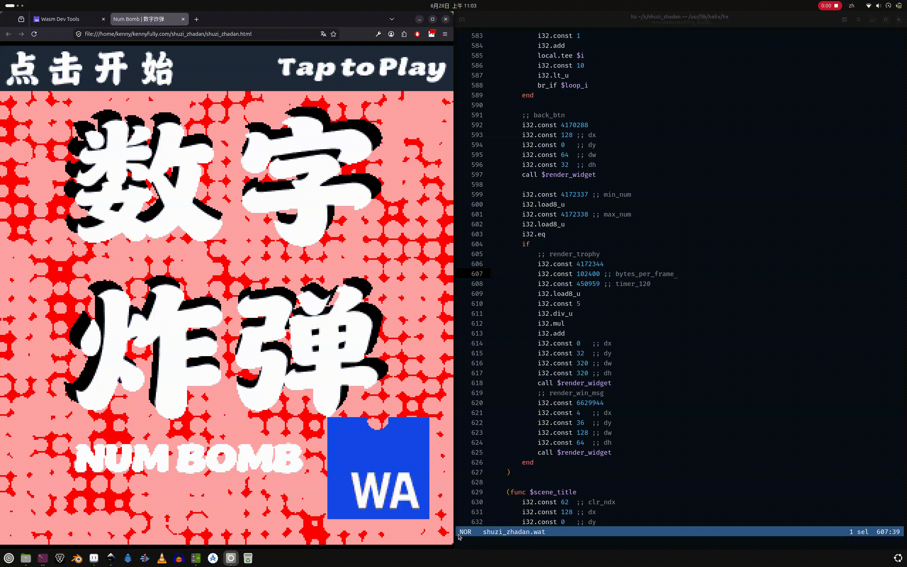

# Num Bomb | Shuzi Zhadan | 数字炸弹
[Live Demo | 实时演示](https://kennyfully1988.github.io/shuzi_zhadan/)



"Shuzi Zhadan" (数字炸弹), also known as "Num Bomb", is a classic number guessing game implemented as Wasm application. This project leverages WebAssembly (Wasm) for its core logic, demonstrating the integration of high-performance code directly within the browser environment. Players guess a number within a specified range, aiming to avoid a hidden "bomb" number.

“数字炸弹”（Shuzi Zhadan）是一款经典的猜数字游戏，以 WebAssembly (Wasm) 应用程序的形式实现。该项目利用 WebAssembly (Wasm) 处理核心逻辑，展示了如何在浏览器环境中直接集成高性能代码。玩家需要在指定范围内猜一个数字，目标是避开那个隐藏的“炸弹”数字。

## Key Features & Benefits | 主要特点与优势

*   **Interactive Web-Based Game:** Enjoy a classic "Num Bomb" guessing game directly in your web browser.
*   **WebAssembly Powered:** Core game logic is implemented using WebAssembly, potentially offering performance advantages and efficient execution.
*   **Simple User Interface:** A straightforward and intuitive user experience provided by `index.html`.
*   **Client-Side Execution:** The application runs entirely on the client side, requiring no server-side dependencies for gameplay once loaded.
*   **Lightweight and Efficient:** Designed to be a compact and fast-loading Wasm application.

*   **交互式网页游戏：** 直接在浏览器中体验经典的“数字炸弹”猜数游戏。
*   **基于 WebAssembly：** 核心游戏逻辑采用 WebAssembly 实现，具备性能优势与高效执行特性。
*   **简洁的用户界面：** 通过 `index.html` 提供直观易用的用户体验。
*   **客户端运行：** 应用程序完全在客户端运行；一旦加载完成，无需任何服务器端依赖即可进行游戏。
*   **轻量高效：** 设计为精简且加载迅速的 Wasm 应用程序。

## Prerequisites & Dependencies | 先决条件与依赖关系

To run or develop this application, you will need the following:
要运行或开发此应用程序，您需要以下内容：

### For Running the Application | 用于运行应用程序

*   **A Modern Web Browser:** Ensure you have an up-to-date web browser (e.g., Chrome, Firefox, Edge, Safari) with full WebAssembly support.
*   **现代 Web 浏览器：** 确保使用完全支持 WebAssembly 的最新版 Web 浏览器（例如 Chrome、Firefox、Edge 或 Safari）。

## Installation & Setup Instructions | 安装与设置说明

Follow these steps to get the `Shuzi Zhadan (Num Bomb)` application up and running on your local machine:
请按照以下步骤在本地计算机上运行 `数字炸弹` 应用程序：

1.  **Clone the Repository | 克隆仓库:**
    Start by cloning the project repository to your local machine using Git:
    首先，使用 Git 将项目仓库克隆到您的本地计算机：

    ```bash
    git clone https://github.com/kennyfully1988/shuzi_zhadan.git
    cd shuzi_zhadan
    ```

    **Directly Opening `index.html` | 直接打开 `index.html`:**
    You can try opening the `index.html` file directly in your browser | 您可以尝试直接在浏览器中打开 `index.html` 文件。 (`file:///path/to/shuzi_zhadan/index.html`).

3.  **Access the Game | 进入游戏:**
    You should now see the "Shuzi Zhadan (Num Bomb)" game interface.
    现在你应该能看到“数字炸弹”的游戏界面了。

## License Information | 许可信息

This project is open-source and distributed under the terms of the **MIT License**.

You can find the full text of the license in the [LICENSE](LICENSE) file within this repository.

本项目为开源项目，依据 **MIT 许可证**的条款发布。

您可以在本仓库的 [LICENSE](LICENSE) 文件中查看该许可证的全文。
